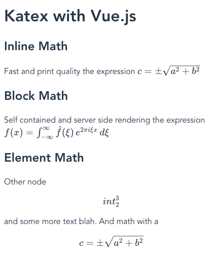

# Vue A11Y Katex

> Katex Accessibility Using Vue.js



## Install

```
$ npm install @dangvanthanh/vue-katex --save
```

## Usage

You can [download Katex](https://github.com/Khan/KaTeX) and host it on your server or use from CDN

```html
<link rel="stylesheet" href="https://cdnjs.cloudflare.com/ajax/libs/KaTeX/0.9.0/katex.min.css" integrity="sha384-TEMocfGvRuD1rIAacqrknm5BQZ7W7uWitoih+jMNFXQIbNl16bO8OZmylH/Vi/Ei" crossorigin="anonymous">
<script src="https://cdnjs.cloudflare.com/ajax/libs/KaTeX/0.9.0/katex.min.js" integrity="sha384-jmxIlussZWB7qCuB+PgKG1uLjjxbVVIayPJwi6cG6Zb4YKq0JIw+OMnkkEC7kYCq" crossorigin="anonymous"></script>
```

### CDN

```html
<script src="https://unpkg.com/vue-katex"></script>
```

### .vue files

##### Import all components

```javascript
import Vue from 'vue'
import KatexMath from 'vue-katex'

Vue.use(KatexMath)
```

##### Usage

```vue
<template>
  <div class="app">
    <inline-math :expression="inlinemathExpr" />
    <block-math :expression="blockmathExpr" />
  <div>
</template>

<script>
export default {
  data () {
    return {
      inlinemathExpr: 'c = \\pm\\sqrt{a^2 + b^2}',
      blockmathExpr: 'f(x) = \\int_{-\\infty}^\\infty\\hat f(\\xi)\\,e^{2 \\pi i \\xi x}\\,d\\xi'
    }
  }
}
</script>
```

## License

MIT © Dang Van Thanh <dangvanthanh@dangthanh.org>
